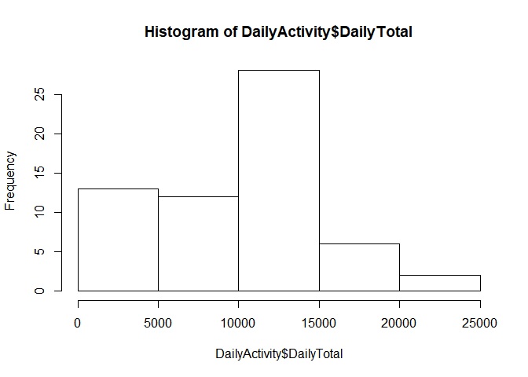
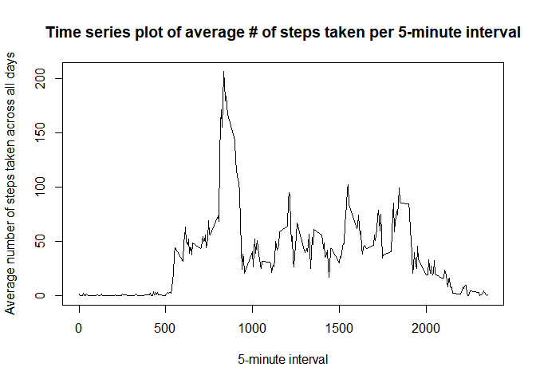
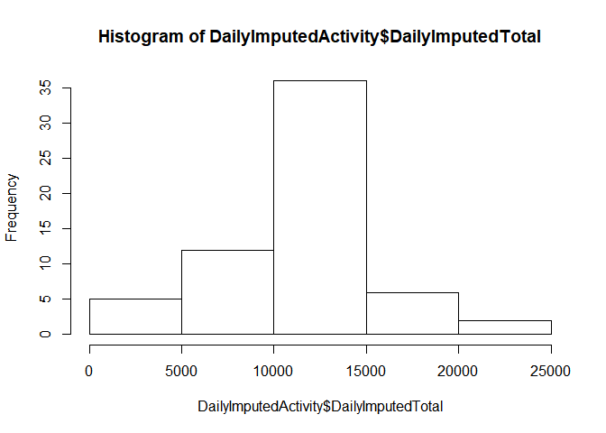
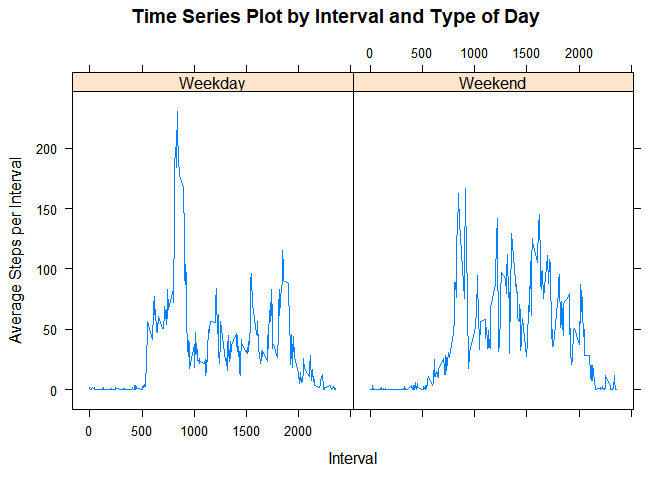

## Loading and preprocessing the data
Activity File is already in Github Repository so downloading the file is not necessary
The file is zipped so the unzip function was used in addition to read.csv


```r
Activity <- read.csv(unzip("activity.zip"))
```

## What is mean total number of steps taken per day?
Calculate the total number of steps per day and remove NA's

```r
library(dplyr)
```

```
## Warning: package 'dplyr' was built under R version 3.4.3
```

```r
DailyActivity <-group_by(Activity, date) %>%
  summarise(DailyTotal = sum(steps, na.rm=TRUE))
```

A histogram of the total number of steps taken per day

```r
hist(DailyActivity$DailyTotal)
```

<!-- -->


Once the total steps have been calculated, mean and median steps per day can also be calculated

```r
MeanSteps <- mean(DailyActivity$DailyTotal, na.rm=TRUE)
MedianSteps <- median(DailyActivity$DailyTotal, na.rm=TRUE)
```
 
*The mean number of steps taken per day is 9354.2295082

*The median number of steps taken per day is 10395


## What is the average daily activity pattern?


```r
IntervalActivity <-group_by(Activity, interval) %>%
  summarise(IntervalAverage = mean(steps, na.rm=TRUE))
plot(
  IntervalActivity$interval
  ,IntervalActivity$IntervalAverage
  ,type = "l"
  ,main="Time series plot of average # of steps taken per 5-minute interval"
  ,xlab = "5-minute interval"
  ,ylab = "Average number of steps taken across all days"
  )
```

<!-- -->


```r
maxInterval <- filter(IntervalActivity,IntervalAverage==max(IntervalAverage))
```

```
## Warning: package 'bindrcpp' was built under R version 3.4.3
```
The 5-minute interval, that contains the maximum number of steps on average across all the days in the dataset is 835

## Imputing missing values


```r
MissingValues <- filter(Activity, is.na(steps))
```
The total number of missing values is 2304

These missing values can create biases in future analysis.  To avoid that, they will be imputed based on the average for that 5-minute interval across all days. Doing this will be a 3 step process

1. Join IntervalActivity to Activity to add the interval average to all observations
2. Use mutate and ifelse to replace missing values with IntervalAverage
3. Drop Interval Average


```r
ImputedActivity<- 
  left_join(Activity, IntervalActivity, by = c("interval" = "interval")) %>%
  mutate(steps = ifelse(is.na(steps),IntervalAverage,steps)) %>%
  select(-IntervalAverage)
```

Calculate the total number of steps per day using this imputed dataset

```r
DailyImputedActivity <-group_by(ImputedActivity, date) %>%
  summarise(DailyImputedTotal = sum(steps))
```

A histogram of the total number of steps taken per day using this imputed dataset

```r
hist(DailyImputedActivity$DailyImputedTotal)
```

<!-- -->


Once the total steps have been calculated, mean and median steps per day can also be calculated

```r
MeanStepsImputed <- mean(DailyImputedActivity$DailyImputedTotal)
MedianStepsImputed <- median(DailyImputedActivity$DailyImputedTotal)
```
 
*The original mean number of steps taken per day is 9354.2295082

*The mean number of steps after imputing missing values is 1.0766189\times 10^{4}

*The original median number of steps taken per day is 10395

*The medain number of steps after imputing missing values is 1.0766189\times 10^{4}

Both mean and median number of steps increased after imputing missing values


## Are there differences in activity patterns between weekdays and weekends?


```r
library(lubridate)
```

```
## Warning: package 'lubridate' was built under R version 3.4.3
```

```r
library(lattice)
ImputedActivityWeekday<- 
  mutate(ImputedActivity,dayofweek = wday(date))%>%
  mutate(Weekday = ifelse(dayofweek == 1 |dayofweek==7, "Weekend", "Weekday")) %>%
  group_by(Weekday, interval) %>%
  summarise(ImputedWeekdayIntervalAverage = mean(steps, na.rm=TRUE))

xyplot(
  ImputedWeekdayIntervalAverage~interval|Weekday
  ,main="Time Series Plot by Interval and Type of Day"
  ,ylab="Average Steps per Interval"
  ,xlab="Interval"
  ,data = ImputedActivityWeekday
  ,type = "l")
```

<!-- -->

Weekdays have a much sharper spike in number of steps taken at the beginning of the day and a smaller spike at the end of the day.  One hypothesis is this is due to users exercising before or after work.
